# Mind-Map
[here](https://miro.com/app/board/o9J_lJ_iMv8=/) you can see a mind-map of segmentation related models.
## A survey of loss functions for semantic
In this paper different loss functions for segmentation were presented (15 different loss function). Each loss function was described, and its best used cases were showed.
There are multiple useful loss functions for different cases (Biased datasets, shape matching, etc.).
________________________________________________________________
## Where is My Mirror
This paper presented (**what was in 2019**) a novel method for segmenting mirrors from *Images* using **MirrorNet** neural network.
The main Idea of MirrorNet is to utilize  multilevel features (low level, high level) and merge them to get the final result.
The main structure of the network is as follows:  
- Feature extraction backbone (in this case was **ResNeXt-101**).
- Multilevel CCFE modules (each for a certain level of feature gotten from the feature extractor)
- CCFE modules "*Contextual Contrasted Features Extraction*" are followed by **Deconve** , **Attention** , **Conv**, then **Sigmoid** to get the result mask.
- Each mask (starting from the highest level (*smallest dimensions*)) is an additional input for the next level CCFE module (*it acts as a mask for the input of the next level*)
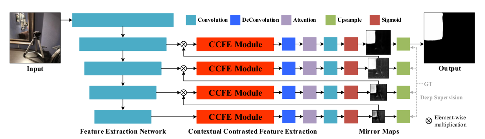
### CCFE modules:
Each module consists of four chained CCFE blocks, and the output of each CCFE block are fused via an attention module to generate multi-level contextual contrasted features. *Contrasted to find the inconsistence to detect the mirrors.*
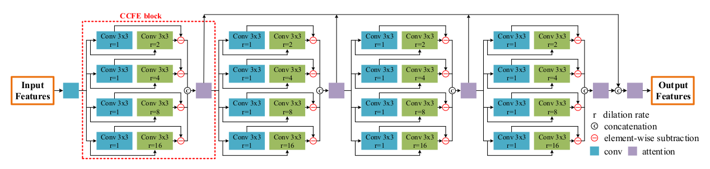
### Problems and Disadvantages:
- In each CCFE module there are 4 CCFE blocks, in each block the model uses **Four BatchNorm2d modules** which dramatically increase the variance of the training process (because it is batch dependent). Especially when the batch size is very small as in the case of huge neural networks as MirrorNet or GDNet.
________________________________________________________________
## Don’t Hit Me! Glass Detection in Real-world Scenes
This paper presented (**what was in 2020**) a novel method for segmenting Glass from *Images* using **GDNet** neural network.
The main Idea of GDNet is to utilize large-field contextual features (low level, high level) and merge them to get the final result.
The main structure of the network is as follows:  
- Multi-level feature extraction backbone (**ResNeXt-101**).
- Multilevel LCFI modules (each for a certain level of feature gotten from the feature extractor)
- Then the 3 highest level features are mreged.
- The resulted merged features are merged again with the low level features
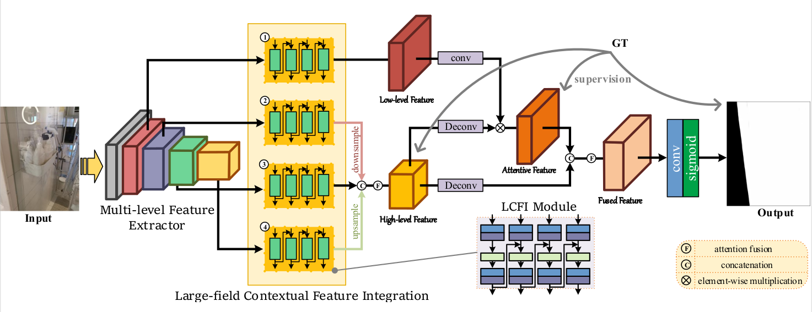
### LCFI modules:
Each module consists of four chained LCFI blocks, and the output of each LCFI block is used as an additional input for the following block.
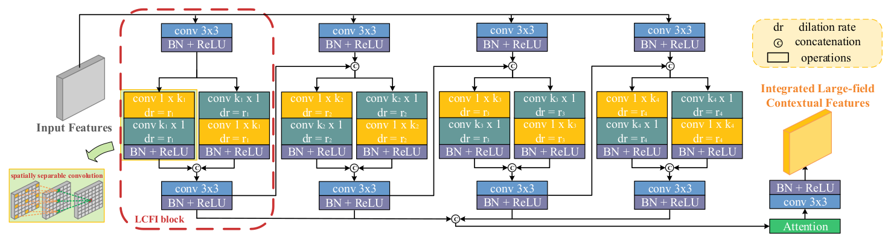
### Problems and Disadvantages:
- In each LCFI module there are 4 LCFI blocks, in each block the model uses **Four BatchNorm2d modules** which dramatically increase the variance of the training process (because it is batch dependent). Especially when the batch size is very small as in the case of huge neural networks as MirrorNet or GDNet.
- The model is very large with a huge number of parameters
________________________________________________________________
## Progressive Mirror Detection
The main contributions of this paper are:
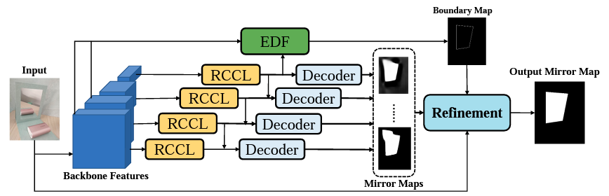
- Relation Contextual Contrasted Local modules (*RRCL modules*)  
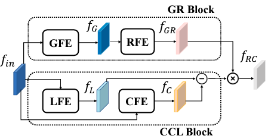
- Edge Detection and Fusion modules. (*EDF modules*)  
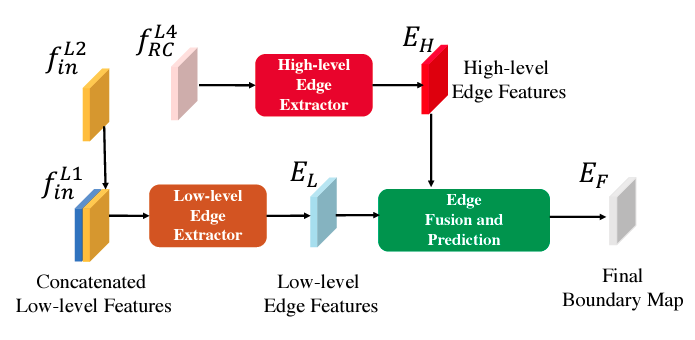
The *RRCL modules* is different than  CCFE, because it does not only considers the contrast, but the similarities too.
They consider the **Global Similarity (Global Relation)** of the global features extracted using *Global Feature Extractor* **GFE**, and they consider the **Local Contrast** using local features extracted using *Local Feature Extractor* **LFE**.
### RRCL modules:
It consists of **Global Relation** and **Contextual Contrast Local ** which are multiplied to find the possible mirror regions.
The **Contextual Contrast Local ** is gotten by subtracting the *Local features* from the *Contextual features* (The differ in the dilation values for different levels)

### EDF modules:
It is designed to extract multi-scale mirror edge features.
It uses *Low Level* and *High Level* features to produce a boundary map.
________________________________________________________________
## Learning a Discriminative Feature Network for Semantic Segmentation
The main contribution of this paper is Discriminative Feature Network which consists of two main sub networks: 1- Smooth network. 2- Border Network.
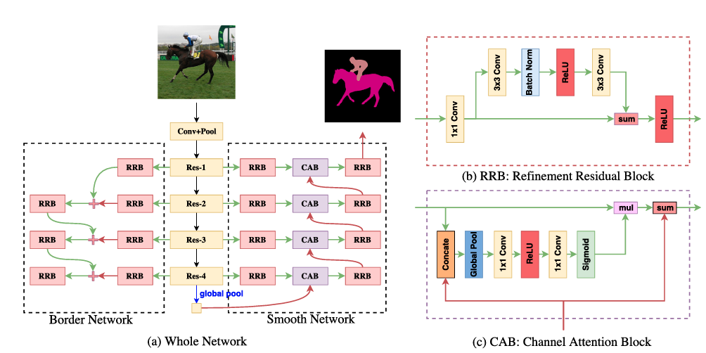
- They use special **Channel Attention Block (CAB)** which uses the features from higher layers to guide the features in the lower layers.
- This paper also uses **Refinement Residual Block (RRB)** which compine information across all channels.
- Global average pooling layer to select more discriminative features.

They show multiple usefull tricks to imporve the performance of the network such as:
1- Flipping the input and averaging the result
2- Deep supervision (softmax loss over different layers)
3- Additional Border network which improves the segmentation accuracy.

### Notes: 
They used Focal loss for training the border network.
the formula they used is not totally clear. 
________________________________________________________________
## DA RNN: Semantic Mapping with Data Associated
This paper is for Scene Dense Semantic Segmentation From RGB-D video input.
There are multiple interesting ideas in this paper:
- They used a different piplines for extracting features from RGB images, and from depth images. then fused at the end.
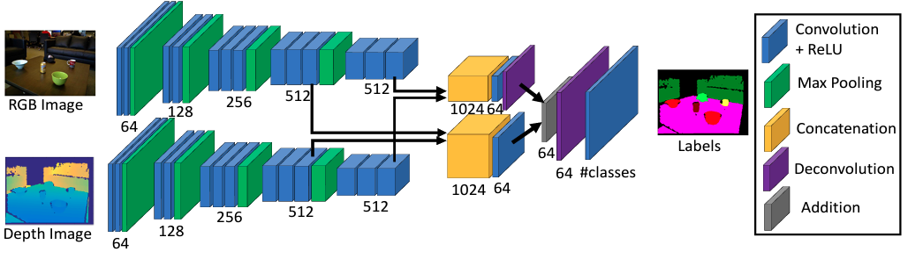
- They used a memory unit for each pixle in the input image.
- The wieghts for each memory cell are a compination of two wieghts (wieght depends on the input data, a transformed wieght "according to pixle transformation using the change in camera position").
________________________________________________________________
## Segmenting Transparent Objects in the Wild.
This paper presents an improvment in the field of semantic segmentation for transparent objects (with two main classes **Things** & **Stuffs**).
They presents large transparent object dataset (10428 images) Trans10K, and they present TransLab neuran network, which outperformed all state-of-the-art segmentation networks in the task of segmenting transparent object (All models trained on Trans10K dataset).
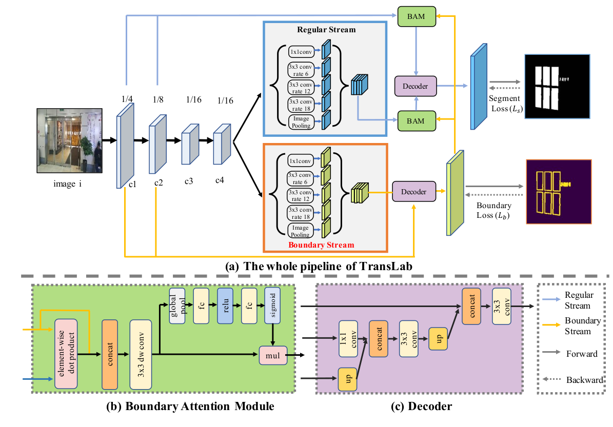
### Advantages:
- They use boundary detection to guide the main-stream transparent object detection.
- They use dice-loss function for boundary detection.
### Notes:
- They did not use **lovasz_hinge** loss function, which proved to out perform other loss functions in the task of segmentation.
________________________________________________________________
## Segmenting Transparent Object in the Wild with Transformer
This paper is mainly an improvement over the previous work *Segmenting Transparent Objects in the Wild*.
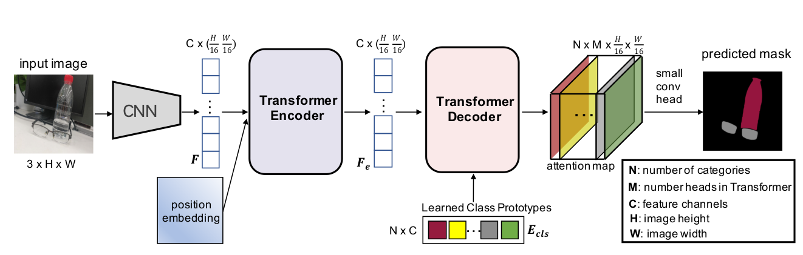
### The main improvements:
- They classified 11 different transparent object class (instead of 2).
- They used Transformer architecture, which provided larger scope and field of view.
- They used Transformer encoders and decoders.
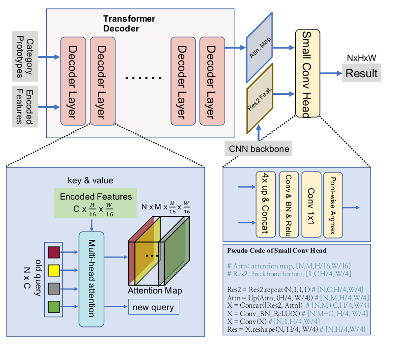
### Notes:
- The structure is not descriped thoroughly.
________________________________________________________________
## EBLNet Enhanced Boundary Learning for Glass-like Object Segmentation
This paper is directed towards enhancing the segmentation of Glass-Like objects by using **enhanced boundary aware model**.
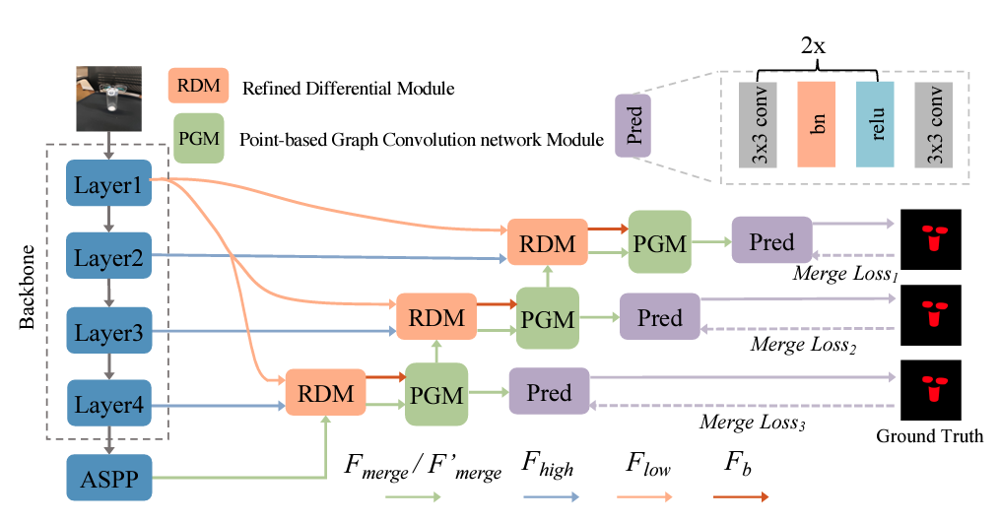
### The main Contribution of this paper are:
- Presented Refined Differential Module (RDM) for generating finer boundary cues.
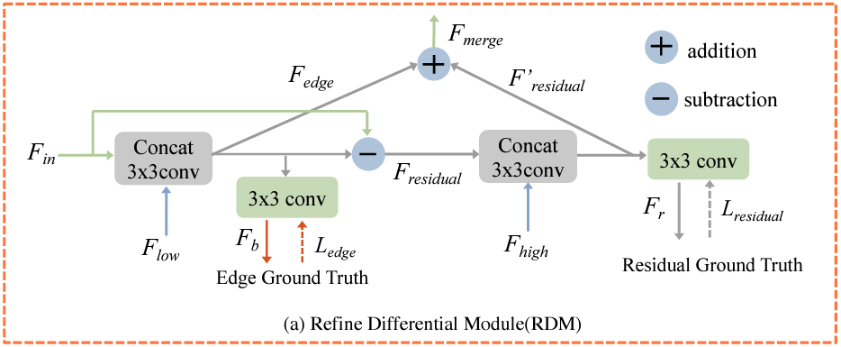
- Presented an edge-aware point-based graph convolutional network module PGM.
- Their model outperformed the recent works such as (GDNet, MirrorNet, and TransLab)
### Advantages:
The main advantage of this work is that the presented modules (**PGM** and **RDM**) are lightweighted and can be added to other segmentation pipelines and enhance the results.
### Notes:
- There are multiple unclear points in the paper.
- They didn't describe the loss function used for edge loss.
- Their calculation is somehow complicated and not easy to follow without any visual representation.
